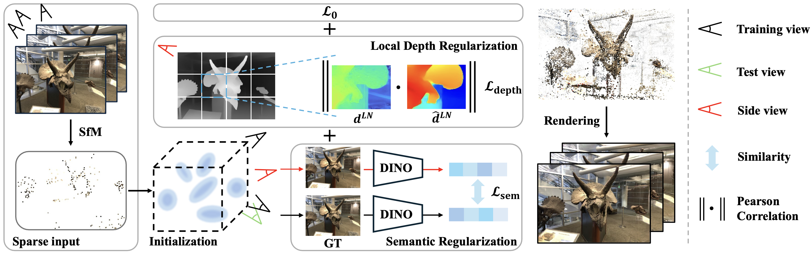

<h1 align="center"><strong>SIDGaussian</strong></h1>
<h2 align="center">See In Detail: Enhancing Sparse-view 3D Gaussian Splatting with Local Depth and Semantic Regularization</h2>

<p align="center">
  Zongqi He<sup>*</sup> ·
  <a href="http://zachary-zhexiao.github.io/">Zhe Xiao</a><sup>*</sup> ·
  Kin-Chung Chan ·
  <a href="https://yushenzuo.github.io/">Yushen Zuo</a><sup></sup> ·
  <a href="https://junxiao01.github.io/">Jun Xiao</a><sup>+</sup> ·
  <a href="https://www.eie.polyu.edu.hk/~enkmlam/">Kin-Man Lam</a><sup></sup>
</p>
<p align="center"><sup>*</sup>Equal Contribution · <sup>+</sup>Corresponding Author</p>

<h3 align="center">ICASSP 2025</h3>

<div align="center">
    <a href="https://arxiv.org/abs/2501.11508">
        
    </a>
</div>

<br>

<div align="center" style="display: flex; justify-content: center;">

  
  
</div>

## Pipeline
<p align="center">
  
</p>

## Abstract
3D Gaussian Splatting (3DGS) has shown remarkable performance in novel view synthesis. However, its rendering quality deteriorates with sparse inphut views, leading to distorted content and reduced details. This limitation hinders its practical application. To address this issue, we propose a sparse-view 3DGS method. Given the inherently ill-posed nature of sparse-view rendering, incorporating prior information is crucial. We propose a semantic regularization technique, using features extracted from the pretrained DINO-ViT model, to ensure multi-view semantic consistency. Additionally, we propose local depth regularization, which constrains depth values to improve generalization on unseen views. Our method outperforms state-of-the-art novel view synthesis approaches, achieving up to 0.4dB improvement in terms of PSNR on the LLFF dataset, with reduced distortion and enhanced visual quality.


## Environmental Setups
We provide install method based on Conda package and environment management:
```bash
git clone https://github.com/wuyou012/SIDGaussian.git
conda env create --file environment.yml
conda activate SIDGaussian
```
or you can use:
```bash
conda create -n SIDGaussian python=3.10
conda activate SIDGaussian
pip install torch==1.13.1+cu117 torchvision==0.14.1+cu117 torchaudio==0.13.1 --extra-index-url https://download.pytorch.org/whl/cu117
git clone https://github.com/wuyou012/SIDGaussian.git
cd SIDGaussian
pip install -r requirements.txt
```
We use **CUDA 11.7** as our environment.

## Data Preparation
We use dense point cloud from [FSGS](https://github.com/VITA-Group/FSGS?tab=readme-ov-file#data-preparation) for initialization.
You may directly download through [this link](https://drive.google.com/drive/folders/1lYqZLuowc84Dg1cyb8ey3_Kb-wvPjDHA).

For the public dataset, you can directly download the llff data [here](https://drive.google.com/drive/folders/1PXEDEECbxhEFG_PkMekJuqVRZB4roDR_?usp=sharing), and combine with the point cloud.

If you are interested in mipnerf360 dataset, you can download through
```dash
wget http://storage.googleapis.com/gresearch/refraw360/360_v2.zip
```
## Training
<!--
Train SIDGaussian on LLFF dataset with 3 views
``` 
for SCENE in fern flower fortress horns leaves orchids room trex
do
  CUDA_VISIBLE_DEVICES=0 python train.py --source_path dataset/nerf_llff_data/$SCENE --model_path output_llff/$SCENE --eval --n_views 3 --sample_pseudo_interval 1 --D 0.8 --W 0.5 --N 1
done
``` 


Train SIDGaussian on MipNeRF-360 dataset with 24 views
``` 
for SCENE in bonsai counter garden kitchen room stump bicycle
do
  CUDA_VISIBLE_DEVICES=0 python train.py --source_path /home/data1/mipnerf360/$SCENE --model_path output_mip/$SCENE --eval --n_views 24 --D 0.1 --W 0.25 --N 0.05
done
``` 
-->
Train SIDGaussian on LLFF dataset with 3 views
``` 
bash scripts_train/llff.sh
``` 

## Rendering
To render images:

```
python render.py --source_path data/nerf_llff_data/horns/ --model_path output/llff/horns --iteration 10000
```

To render a video:

```
python render.py --source_path data/nerf_llff_data/horns/ --model_path output/llff/horns --iteration 10000 --video --fps 30
```

## Evaluation
The training code train.py automatically save evaluation scores, you can also run the following script to evaluate the model.

```
python metrics.py --source_path data/nerf_llff_data/horns/ --model_path output/llff/horns --iteration 10000
```

## Acknowledgement

Thanks to the following awesome open source projects!

- [Gaussian-Splatting](https://github.com/graphdeco-inria/gaussian-splatting)
- [LLFF](https://github.com/Fyusion/LLFF)
- [FSGS](https://github.com/VITA-Group/FSGS)

## Citation
If you find this project useful, please consider citing:
```
@article{he2025see,
  title={See In Detail: Enhancing Sparse-view 3D Gaussian Splatting with Local Depth and Semantic Regularization},
  author={He, Zongqi and Xiao, Zhe and Chan, Kin-Chung and Zuo, Yushen and Xiao, Jun and Lam, Kin-Man},
  journal={arXiv preprint arXiv:2501.11508},
  year={2025}
}
```

